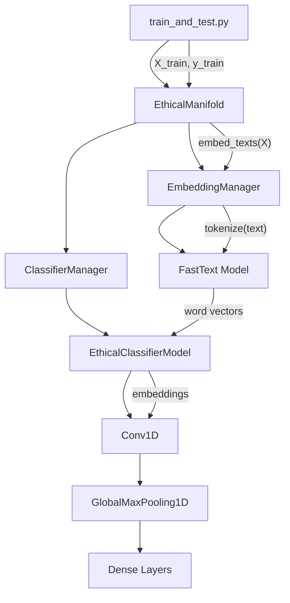

# Ethical Manifolds

Ethical Manifolds is a project that aims to analyze and classify text based on ethical dimensions using deep learning.

## Architecture

The project uses a modular architecture with the following main components:

1. **EthicalManifold**: The main class that orchestrates the entire process.
2. **EmbeddingManager**: Handles text tokenization and embedding using FastText.
3. **ClassifierManager**: Manages multiple ethical dimension classifiers.
4. **EthicalClassifierModel**: The neural network model for classification.

Here's a high-level overview of the architecture:


## What are Ethical Manifolds?

Ethical Manifolds are a multi-dimensional ethical space where texts can be positioned based on their ethical characteristics. This is achieved using a combination of sentence embedding models and classifiers trained on ethical dimensions such as:

- Fairness
- Utilitarianism
- Deontology
- Virtue ethics
- Care ethics

## Key Features

- Utilizes pre-trained FastText embeddings for robust word representation
- Implements a CNN-based classifier for each ethical dimension
- Supports multiple ethical dimensions (e.g., fairness, utility, virtue)
- Provides visualization tools for embedding analysis and ethical scores

## How It Works

1. Sentence Embedding: Input text is converted into a high-dimensional vector using a pre-trained sentence embedding model.
2. Ethical Classification: The embedding is passed through multiple classifiers, each trained on a specific ethical dimension.
3. Manifold Positioning: The resulting scores are used to position the text within the ethical manifold.
4. Visualization (optional): The high-dimensional ethical space can be reduced to 2D or 3D for visualization purposes.

## Installation

To install Ethical Manifolds, follow these steps:

1. Clone the repository:
   ```
   git clone https://github.com/crbazevedo/ethical-manifolds.git
   cd ethical-manifolds
   ```

2. Create a virtual environment (optional but recommended):
   ```
   python -m venv env
   source env/bin/activate  # On Windows, use `env\Scripts\activate`
   ```

3. Install the required dependencies:
   ```
   pip install -r requirements.txt
   ```

## Usage

Here's a basic example of how to use Ethical Manifolds:

```python
from ethical_manifolds import EthicalManifold
#Initialize the Ethical Manifold
manifold = EthicalManifold()
#Analyze a text
text = "AI should be developed with careful consideration of its ethical implications."
results = manifold.analyze(text)
#Print the results
for dimension, score in results.items():
print(f"{dimension}: {score}")
#Visualize the text in the ethical space (if visualization is enabled)
manifold.visualize(text)
```

For more detailed usage instructions and advanced features, please refer to the [documentation](docs/README.md).

## Ethical Dimensions

The project currently supports the following ethical dimensions:
- Fairness Score
- Utility Score
- Virtue Score

## Model Architecture

The `EthicalClassifierModel` uses a Convolutional Neural Network (CNN) architecture:
1. Input layer accepting FastText word embeddings
2. Convolutional layer (Conv1D)
3. Global Max Pooling layer
4. Dense layers for classification

## Contributing

We welcome contributions to the Ethical Manifolds project! If you'd like to contribute, please follow these steps:

1. Fork the repository
2. Create a new branch for your feature or bug fix
3. Make your changes and commit them with clear, descriptive messages
4. Push your changes to your fork
5. Create a pull request to the main repository

Please read our [Contributing Guidelines](CONTRIBUTING.md) for more details.

## License

This project is licensed under the MIT License - see the [LICENSE](LICENSE) file for details.

## Citation

If you use Ethical Manifolds in your research or project, please cite it as follows:

```
@software{ethical_manifolds,
  author = {Carlos R. B. Azevedo},
  title = {Ethical Manifolds},
  year = {2024},
  url = {https://github.com/crbazevedo/ethical-manifolds}
}
```

## Contact

For questions, suggestions, or collaborations, please open an issue on this repository or contact [renatoaz@gmail.com](mailto:renatoaz@gmail.com).
